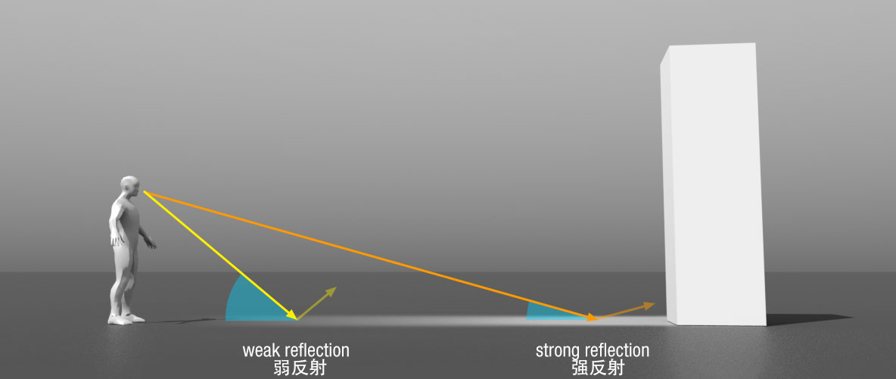
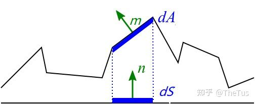
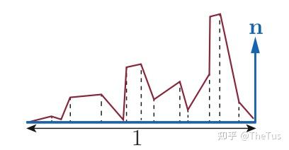
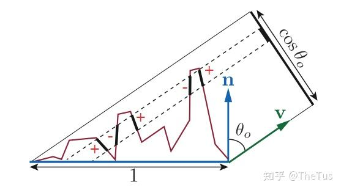
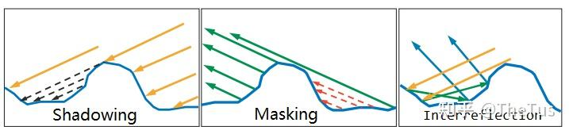

# BRDF
BRDF考虑了菲涅尔反射，微表面理论中的法线分布函数、遮蔽函数。

## 菲涅尔反射
当一束光线打到平面后，会同时发生反射和折射，入射光的能量被分散到反射和折射上。


菲涅尔效应（Fresnel Effect）指的是反射随着掠射角(Glancing Angle, 入射光与表面的夹角) 的增大而减小。也即当入射光方向越垂直平面，折射越强；当入射光方向越平行平面，反射越强。



所以看物体在水面的倒影时，离我们远的物体更清楚，因为反射更强，离我们近的物体更模糊，因为反射更弱。

### 菲涅尔方程

菲涅尔方程给出了不同偏振下的反射率。设入射介质折射率为 $n_1$，透射介质为 $n_2$，入射角为 $\theta_i$，折射角为 $\theta_t$，满足斯涅尔定律 $n_1\sin\theta_i = n_2\sin\theta_t$。

- 非导体（介电质，$\kappa=0$）：
$$
R_s = \left(\frac{n_1\cos\theta_i - n_2\cos\theta_t}{n_1\cos\theta_i + n_2\cos\theta_t}\right)^2,\quad
R_p = \left(\frac{n_1\cos\theta_t - n_2\cos\theta_i}{n_1\cos\theta_t + n_2\cos\theta_i}\right)^2
$$
未偏振光的反射率为 $ R = (R_s + R_p)/2 $。当 $n_1>n_2$ 且 $\sin\theta_i > n_2/n_1$ 时发生全反射：$R=1$。

- 导体（复折射率 $\tilde{n}=\eta + i\kappa$）：令 $c=\cos\theta_i$，则
$$
R_s = \frac{(\eta^2+\kappa^2) - 2\eta c + c^2}{(\eta^2+\kappa^2) + 2\eta c + c^2},\quad
R_p = \frac{(\eta^2+\kappa^2)c^2 - 2\eta c + 1}{(\eta^2+\kappa^2)c^2 + 2\eta c + 1}
$$
同样取 $ R = (R_s + R_p)/2 $。

为实际渲染常用的近似：

- Schlick 近似（介电质）：
$$
R(\theta_i) = R_0 + (1-R_0)(1-\cos\theta_i)^5,\quad
R_0 = \left(\frac{n_1-n_2}{n_1+n_2}\right)^2
$$

- Schlick 近似（导体，按通道）：
$$
R_0 = \frac{(\eta-1)^2+\kappa^2}{(\eta+1)^2+\kappa^2}
$$


## 微表面理论
微表面模型是把宏观上的一块平面，看成若干个微小有起伏的平面的组合。
如下图所示，dS层可以看作宏观上的平面，dA层则是微观上的若干个微表面。


### 法线分布函数（NDF，Normal Distribution Function）
对于每一个微表面，都有自己的微表面法线$m$，表面的宏观法线一般表示为$n$。法线分布函数是用来描述微表面法线的分布情况的函数$D(m)$。

法线分布函数是对微表面法线在微观几何表面上的统计分布，即$D(m)$表示法线方向为$m$的微表面在微观几何中的密度。

法线分布函数有如下性质：
- 法线分布函数与微平面法线的积分为微表面面积。



$$
A_{\text{micro}} 
= \int_{\Omega^+} D(m)\,\mathrm{d}\omega_m \;\;\ge\; 1
\quad (\text{以宏观单位面积为基准})
$$

- 微平面法线投影到宏观表面上面积的积分为宏观表面面积(规定为1)。


$$
\int_{\Omega^+} D(m)\,\big(n\cdot m\big)\,\mathrm{d}\omega_m 
= 1
$$

- 微表面法线投影到视角垂平面等效于宏观法线投影到视角垂平面。



设视线方向为 $v$ 且 $n\cdot v>0$，则有
$$
\int_{\Omega^+} D(m)\,\max\!\big(0,\,v\cdot m\big)\,\mathrm{d}\omega_m 
= n\cdot v
$$

#### 常见的法线函数
设半程向量为 $h$，宏观法线为 $n$，$c=n\cdot h=\cos\theta_h$。

- Phong（经典各向同性）：
$$
D_{\text{Phong}}(h) = \frac{n_p+2}{2\pi}\,c^{\,n_p}\quad (c>0)
$$

- Beckmann（高斯斜率）：
$$
D_{\text{Beck}}(h) = \frac{\exp\!\left(-\tan^2\!\theta_h/\alpha^2\right)}{\pi\,\alpha^2\,c^{4}}
$$

- GGX / Trowbridge–Reitz：
$$
D_{\text{GGX}}(h) = \frac{\alpha^2}{\pi\,\big[(\alpha^2-1)\,c^2 + 1\big]^2}
$$

- 各向异性 GGX（切线空间粗糙度 $\alpha_x,\alpha_y$）：
$$
D_{\text{GGX-aniso}}(h) = \frac{1}{\pi\,\alpha_x\alpha_y\,\Big[\big(h_x/\alpha_x\big)^2 + \big(h_y/\alpha_y\big)^2 + h_z^2\Big]^2}
$$

参数与粗糙度的常用近似关系（经验）：
$$
\alpha \approx \text{roughness}^2,\qquad n_p \approx \frac{2}{\alpha^2}-2
$$
其中 $\text{roughness}\in[0,1]$ 为艺术参数，$n_p$ 为 Phong 指数。

### 联合遮蔽-阴影函数(joint masking-shadowing function) 
在微表面模型中，光线在微表面上的弹射会导致遮挡，有 $Shadowing$ 和 $Masking$ 两种情况。$Shadowing$ 是入射光被微表面遮挡，$Masking$ 是反射光被微表面遮挡。一般用 $G_1(v,m)$ 表示 Masking。



同时考虑 $Shadowing$ 和 $Masking$ 两种情况的函数被称为联合遮蔽-阴影函数 $G_2(l,v,m)$，也被称为几何函数。

实际应用中，常用 $The Smith Shadow-Masking G2$ 函数，它将$Shadowing$和$Masking$分开考虑。由于光路的可逆性，我们可以认为两种情况是近似等效的，因为用 $G_1(v,m)$ 表示$ Masking$，则用$G_1(l,m)$ 表示 $Shadowing$。

$$
G_2(l,v,m) = G_1(v,m)\,G_1(l,m)
$$

它建立在Shadowing和Masking不相关的基础上，但实际上它们是相关的。使用这个G2会导致BRDFs结果偏暗。

## 宏观BRDF
基于微表面理论，给出微BRDF $f_{u}(l,v,m)$，法线分布函数$D(m)$，联合遮蔽-阴影函数$G_2(l,v,m)$，可以推出宏观BRDF

$$
f(l,v) = \int_{m \in \Omega^+} f_{u}(l,v,m)\,D(m)\,G_2(l,v,m)\,\frac{\max(0,\,m\cdot l)}{|n\cdot l|}\,\frac{\max(0,\,m\cdot v)}{|n\cdot v|}\,\mathrm{d}\omega_m
$$

$\frac{\max(0,\,m\cdot l)}{|n\cdot l|}$,$\frac{\max(0,\,m\cdot v)}{|n\cdot v|}$是为了归一化。


## 镜面反射BRDF

在镜面微面元模型下，每个微平面都是一个完美的菲涅尔镜(Fresnel mirror)。只有当微平面的法线 $m$ 与 $l$ 和 $v$ 的半程向量 $h = \frac{l+v}{\lVert l+v\rVert}$ 一致时，该微面元才把能量反射进视线方向。


$$
h = \frac{l+v}{\lVert l+v\rVert},\quad m = h,\quad n\cdot l>0,\; n\cdot v>0,\; l\cdot m>0,\; v\cdot m>0
$$
等价的反射约束写法为：
$$
v = 2\,(m\cdot l)\,m - l
$$


# 一种常用的BRDF——Cook Torrance BRDF
Cook-Torrance BRDF兼有漫反射和镜面反射两个部分：

$$
f_{r} = k_{d}f_{lambert} + k_{s}f_{cook-torrance}
$$

- $k_{d}$表示入射光线中，被折射部分能量的比率
- $k_{s}$表示反射光线中，被反射部分的比率
- $k_{d}$ 和 $k_{s}$一般由艺术家设置，不同的材质，这两个参数的值不同

## 漫反射

$$
f_{lambert} = \frac{c}{\pi}
$$

- $c$表示表面颜色
- $\pi$ 是为了对漫反射光标准化，因为前面含有BRDF的积分方程是受 $\pi$ 影响的

Lambertian漫反射模型已经足够应付大多数实时渲染的用途了

## 镜面反射
对于Cook Torrance BRDF，
半程向量 $h=\dfrac{l+v}{\lVert l+v\rVert}$，取理想镜面微 BRDF 为
$$
f_u(l,v,m)=
\begin{cases}
\dfrac{F(v,m)}{4\,|v\cdot m|\,|l\cdot m|}, & m = h \\
0, & m \ne h
\end{cases}
$$
代入宏观BRDF积分
$$
f(l,v) = \int_{m \in \Omega^+} f_{u}(l,v,m)\,D(m)\,G_2(l,v,m)\,\frac{\max(0,\,m\cdot l)}{|n\cdot l|}\,\frac{\max(0,\,m\cdot v)}{|n\cdot v|}\,\mathrm{d}\omega_m
$$
可得
$$
f_{cook-torrance}(l,v) = \frac{D(h)\,G_2(l,v,h)\,F(v,h)}{4\,|n\cdot l|\,|n\cdot v|}
$$

## 最终公式

$$
f_{r} = k_{d}\frac{c}{\pi} + k_{s}\frac{D(h)\,G_2(l,v,h)\,F(v,h)}{4\,|n\cdot l|\,|n\cdot v|}
$$

一般而言，

- D公式选用Trowbridge-Reitz GGX函数近似
$$
D_{\text{GGX}}(h) = \frac{\alpha^2}{\pi\,\big[(\alpha^2-1)\,c^2 + 1\big]^2}
$$
$\alpha$为粗糙度。

- F项选用schilick近似
$$
F_{schilick}(v,h,F_0) = F_0 + (1-F_0)\,\big(1- v\cdot h\big)^5
$$

- G的公式选用schlick-GGX近似
$$
G_{ggx}(n,v,k) = \frac{n \cdot v}{(n \cdot v)(1-k) + k}
$$

$k$ 是一个和粗糙度roughness有关的常数。 一个完整的G函数由两部分组成:

$$
G(n, v, l, k) \approx G_{ggx}(n,v,k) G_{ggx}(n,l,k)
$$

```
vec3 evaluateSpecular(...)
{
    //计算光线达到点p处的能量
    float radiance = evaluateRadiance(light, pixel); 

    float NDF = evaluateDistributionGGX(...);  //法线方程  
    float G   = evaluateGeometrySmith(...);    //几何函数
    vec3 F    = evaluateFresnelSchlick(...);   //菲涅尔函数

    float denominator = ...;  //根据一些参数计算出一个常量
    vec3 specular = NDF * G * F / denominator;

    return specular;
}
```

# 参考

- 知乎专栏合集：BRDF/渲染相关 [链接](https://zhuanlan.zhihu.com/c_1647165706373316609)
- 知识库/计算机图形学/Cook Torrance BRDF [链接](https://geodoer.github.io/A-%E8%AE%A1%E7%AE%97%E6%9C%BA%E5%9B%BE%E5%BD%A2%E5%AD%A6/2-%E6%B8%B2%E6%9F%93%E6%A6%82%E8%BF%B0/%E5%85%89%E7%85%A7%E4%B8%8E%E6%9D%90%E8%B4%A8/PBR/PBR%E5%8E%9F%E7%90%86/BRDF/Cook-Torrance%20BRDF/)
- PBR渲染: Cook-Torrance的实现与补充 [链接](https://www.blurredcode.com/2021/05/dec701b2/#%e5%87%a0%e4%bd%95%e9%81%ae%e8%94%bd%e9%a1%b9g)
