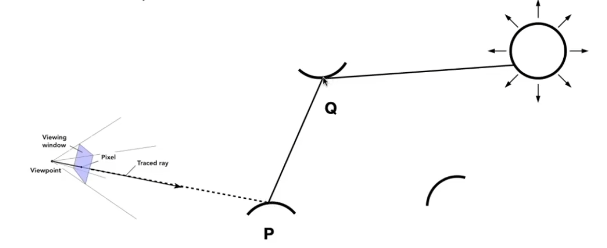
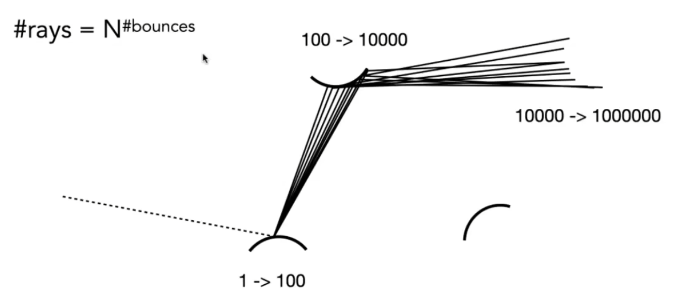

# RayTracing概述
## 渲染方程
每个点的Radiance = 该点的自发光Radiance + 该点反射出的 来自其他光源的Radiance。

$$L_o(p,\omega_o) = L_e(p,\omega_o) + \int_{\Omega} f_r(p,\omega_i,\omega_o) L_i(p,\omega_i) \cos\theta_i d\omega_i$$ 

其中：
- $p$ 是表面上的点（point on surface）
- $\omega_o$ 是出射方向（outgoing direction）
- $\omega_i$ 是入射方向（incoming direction）
- $L_o(p,\omega_o)$ 是从点 $p$ 沿方向 $\omega_o$ 出射的辐射度（outgoing radiance）
- $L_e(p,\omega_o)$ 是点 $p$ 沿方向 $\omega_o$ 的自发光辐射度（emitted radiance）
- $f_r(p,\omega_i,\omega_o)$ 是双向反射分布函数（BRDF - Bidirectional Reflectance Distribution Function）
- $L_i(p,\omega_i)$ 是从方向 $\omega_i$ 入射到点 $p$ 的辐射度（incoming radiance）
- $\cos\theta_i$ 是入射角 $\theta_i$ 的余弦值，表示光线与表面法线的夹角
- $\Omega$ 是半球积分域（hemisphere integration domain）
- $d\omega_i$ 是立体角微元（solid angle differential）

### 物理意义解释

渲染方程描述了光线在表面上的反射行为：

1. **自发光项** $L_e(p,\omega_o)$：表示表面本身发出的光，如灯泡、火焰等光源
2. **反射项** $\int_{\Omega} f_r(p,\omega_i,\omega_o) L_i(p,\omega_i) \cos\theta_i d\omega_i$：
   - 积分表示对所有可能入射方向的贡献求和
   - BRDF $f_r$ 描述材料如何将入射光反射到出射方向
   - $\cos\theta_i$ 项体现了朗伯定律（Lambert's law），入射角越大，贡献越小
   - 这个积分计算了来自所有方向的光线对出射辐射度的贡献

### 数学含义

- 这是一个**积分方程**，因为 $L_i$ 本身可能依赖于其他表面的 $L_o$
- 在全局光照中，这个方程需要递归求解
- 在光线追踪中，我们通过采样来近似这个积分

## BRDF（双向反射分布函数）

BRDF $f_r(p,\omega_i,\omega_o)$ 描述了材料如何将入射光反射到出射方向。它满足以下性质：

### 1. 能量守恒
$$\int_{\Omega} f_r(p,\omega_i,\omega_o) \cos\theta_i d\omega_i \leq 1$$

### 2. 互易性（Helmholtz互易性）
$$f_r(p,\omega_i,\omega_o) = f_r(p,\omega_o,\omega_i)$$

### 3. 常见BRDF模型

**朗伯反射（Lambertian）**：
$$f_r(p,\omega_i,\omega_o) = \frac{\rho}{\pi}$$

其中 $\rho$ 是反射率（albedo）。

**镜面反射（Specular）**：
$$f_r(p,\omega_i,\omega_o) = \frac{F(\theta_h) D(\theta_h) G(\omega_i,\omega_o)}{4\cos\theta_i\cos\theta_o}$$

其中：
- $F$ 是菲涅尔反射系数
- $D$ 是法线分布函数
- $G$ 是几何遮蔽函数

## PDF（概率密度函数）解释

PDF（Probability Density Function）是蒙特卡洛积分中的关键概念：

### 什么是PDF？
- **定义**：PDF $p(\omega_i)$ 描述在方向 $\omega_i$ 上采样的概率密度
- **作用**：告诉我们在哪个方向更可能采样到重要的光线
- **归一化**：$\int_{\Omega} p(\omega_i) d\omega_i = 1$

### 为什么需要PDF？
在渲染方程中：
$$L_o(p,\omega_o) = L_e(p,\omega_o) + \int_{\Omega} f_r(p,\omega_i,\omega_o) L_i(p,\omega_i) \cos\theta_i d\omega_i$$

我们通过随机采样来近似这个积分：
$$\approx L_e(p,\omega_o) + \frac{1}{N} \sum_{i=1}^{N} \frac{f_r(p,\omega_i,\omega_o) L_i(p,\omega_i) \cos\theta_i}{p(\omega_i)}$$

```
总贡献 = 0
for i = 1 to N:
    ω = 根据PDF随机选择一个方向
    贡献 = fr(ω) * Li(ω) * cos(θ) / pdf(ω)
    总贡献 += 贡献
最终结果 = 总贡献 / N
```

### 常见PDF策略

1. **均匀采样**：$p(\omega_i) = \frac{1}{2\pi}$（所有方向等概率）
2. **余弦加权采样**：$p(\omega_i) = \frac{\cos\theta_i}{\pi}$（更可能采样接近法线的方向）
3. **BRDF采样**：$p(\omega_i) \propto f_r(p,\omega_i,\omega_o)$（根据BRDF形状采样）
4. **光源采样**：$p(\omega_i) \propto \frac{1}{d^2}$（更可能采样距离近的光源方向）

### 光源采样详解

光源采样是一种重要的优化技术，直接向光源方向采样：

```
// 光源采样伪代码
Vector3 sampleLight(Point p) {
    // 选择光源
    Light light = selectLight();
    
    // 计算从p到光源的方向
    Vector3 lightDir = normalize(light.position - p);
    
    // 计算距离
    float distance = length(light.position - p);
    
    // 计算PDF（考虑距离衰减）
    float pdf = 1.0 / (distance * distance);
    
    return lightDir;
}

// 在shade函数中使用
shade(p, wo) {
    Lo = Le(p, wo)
    
    // 1. 光源采样（直接光照）
    Vector3 wi_light = sampleLight(p);
    Ray shadowRay(p, wi_light);
    if (!intersect(shadowRay)) {
        float cosTheta = dot(normal, wi_light);
        Lo += fr(p,wi_light,wo) * light.intensity * cosTheta / pdf_light;
    }
    
    // 2. BRDF采样（间接光照）
    Vector3 wi_brdf = sampleBRDF(wo);
    // ... 递归计算
    
    return Lo;
}
```

### 多重重要性采样（MIS）

结合光源采样和BRDF采样，使用权重函数：

```
// 权重函数
float powerHeuristic(float pdf1, float pdf2) {
    float w1 = pdf1 * pdf1;
    float w2 = pdf2 * pdf2;
    return w1 / (w1 + w2);
}

// 在shade函数中
shade(p, wo) {
    Lo = Le(p, wo)
    
    // 光源采样
    Vector3 wi_light = sampleLight(p);
    float pdf_light = lightPdf(wi_light);
    float pdf_brdf = brdfPdf(wi_light, wo);
    float weight_light = powerHeuristic(pdf_light, pdf_brdf);
    
    // BRDF采样  
    Vector3 wi_brdf = sampleBRDF(wo);
    float pdf_brdf2 = brdfPdf(wi_brdf, wo);
    float pdf_light2 = lightPdf(wi_brdf);
    float weight_brdf = powerHeuristic(pdf_brdf2, pdf_light2);
    
    // 加权求和
    Lo += weight_light * evaluateLightContribution(wi_light);
    Lo += weight_brdf * evaluateBRDFContribution(wi_brdf);
    
    return Lo;
}
```

### 重要性采样
- **目标**：减少噪声，提高收敛速度
- **原理**：在贡献大的区域多采样，在贡献小的区域少采样
- **效果**：相同样本数下获得更准确的结果

## 直接光照
只考虑直接光照的光追，是从屏幕每个pixel发出射线，射线方向是viewpoint->pixel，计算每条光线上的Radiance。如果光线打到光源，则增加Radiance的值。

对于直接光照，渲染方程简化为：

$$L_o(p,\omega_o) = L_e(p,\omega_o) + \sum_{i=1}^{n} f_r(p,\omega_i,\omega_o) L_i(p,\omega_i) \cos\theta_i$$

其中：
- $L_o(p,\omega_o)$ 是出射辐射度（outgoing radiance）
- $L_e(p,\omega_o)$ 是自发光辐射度（emitted radiance）
- $f_r(p,\omega_i,\omega_o)$ 是BRDF（双向反射分布函数）
- $L_i(p,\omega_i)$ 是入射辐射度（incoming radiance）
- $\cos\theta_i$ 是入射角余弦值
- $n$ 是光源数量


```
shade(p,w0)
    Lo = Le(p,wo)  // 自发光项
    Randomly sample N directions wi (i=1 to N) based on the pdf
    For each wi
        Trace a ray r(p,wi)
        if ray hit a light
            Lo += (1/N) * fr(p,wi,wo) * Li(p,wi) * cos(θi) / pdf(wi)
    return Lo
```

## 全局光照
不仅仅只考虑打到光源的光线，如果光线打到某个物体上，则把这个物体也当作一个起点，发散$N$条光线，看是否接触到光源，或是别的物体。

```
shade(p,w0)
    Lo = Le(p,wo)  // 自发光项
    Randomly sample N directions wi (i=1 to N) based on the pdf
    For each wi
        Trace a ray r(p,wi)
        if ray hit a light
            Lo += (1/N) * fr(p,wi,wo) * Li(p,wi) * cos(θi) / pdf(wi)
        else if ray hit an object at q
            Lo += (1/N) * shade(q, -wi) * f_r * cos(θi) / pdf(wi)
    return Lo
```



光线的传播如下图所示，性能爆炸：


## 路径追踪（一个具体的光追算法）
在全局光照中，如果取$N = 1$，那么这个算法就被称为路径追踪
```
shade(p,w0)
    Lo = Le(p,wo)  // 自发光项
    Randomly choose ONE direction wi(i=1) base on pdf
    Trace a ray r(p,wi)
    if ray hit a light
        Lo += fr(p,wi,wo) * Li(p,wi) * cos(θi) / pdf(wi)
    else if ray hit an object at q
        Lo += shade(q, -wi) * f_r * cos(θi) / pdf(wi)
    return Lo
```

## Ray Generation
上面讲的是从viewpoint to piexl打出一条光线后，这条光线如何计算。这里讲从viewpoint to piexl的光线是如何生成的，以及如何计算最终的渲染结果。一个pixel也可以打出若干条光线。

```
ray_generation(camPos，pixel)
    Uniformly choose N sample positions within the pixel
    pixel_radiance = 0.0
    for each sample in the pixel:
        Shoot a ray r(camPos, camPos_to_sample)
        if ray r hit p（object or light）
            pixel_radiance += 1/N * shade(p，sample_to_camPos)
    return pixel_radiance
```
这里p不需要区分是光源还是普通物体，因为shade函数已经包含了自发光项$L_e(p,\omega_o)$，能够统一处理两种情况：
- 如果p是光源，自发光项会返回光源的辐射度
- 如果p是普通物体，自发光项为零，只计算反射光

## 算法停止

### 俄罗斯轮盘赌（Russian Roulette）

在光线追踪中，递归可能无限进行下去，需要一种机制来停止算法。俄罗斯轮盘赌是一种概率终止方法：

```
shade(p, wo, depth) 
    // 俄罗斯轮盘赌：设定一个概率值continue_probability，随机取一个[0,1]的random()值
    if random() > continue_probability:
        return 0.0;  // 终止递归
    
    Lo = Le(p, wo)  // 自发光项
    Randomly sample ONE direction wi based on pdf
    Trace a ray r(p, wi)
    if ray hit a light:
        Lo += fr(p,wi,wo) * Li(p,wi) * cos(θi) / pdf(wi)
    else if ray hit an object at q:
        Lo += shade(q, -wi, depth+1) * fr(p,wi,wo) * cos(θi) / pdf(wi)
    
    // 补偿能量：除以继续概率
    return Lo / continue_probability
```
