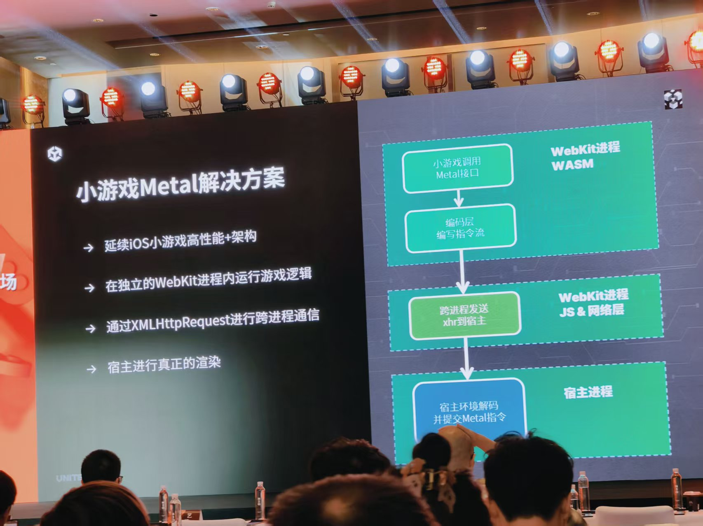
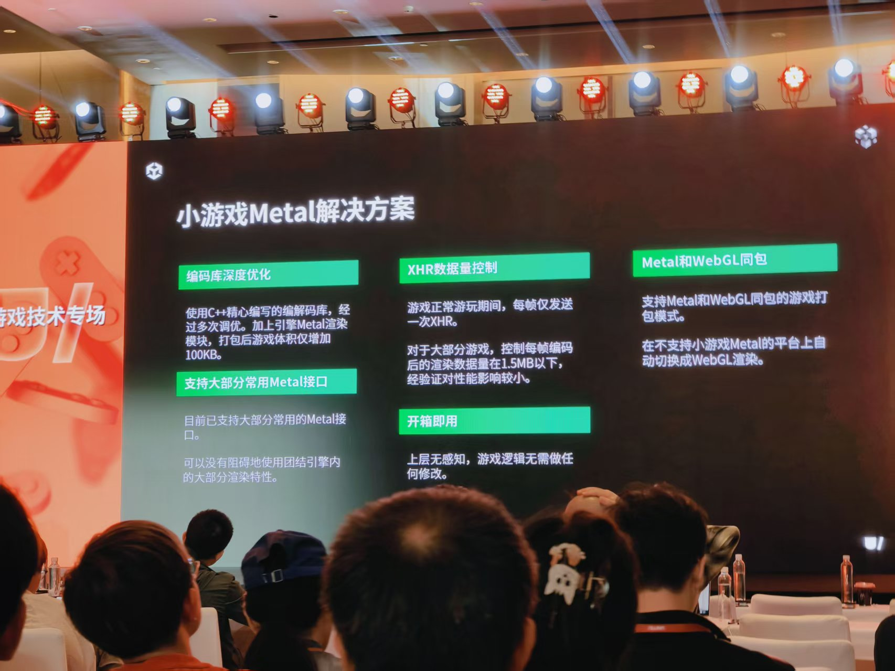
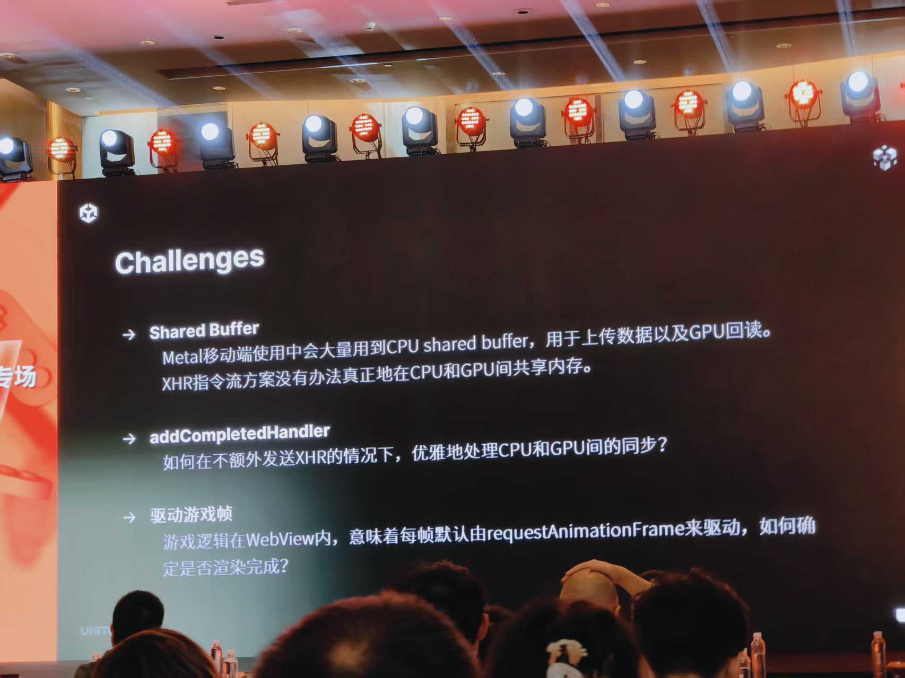
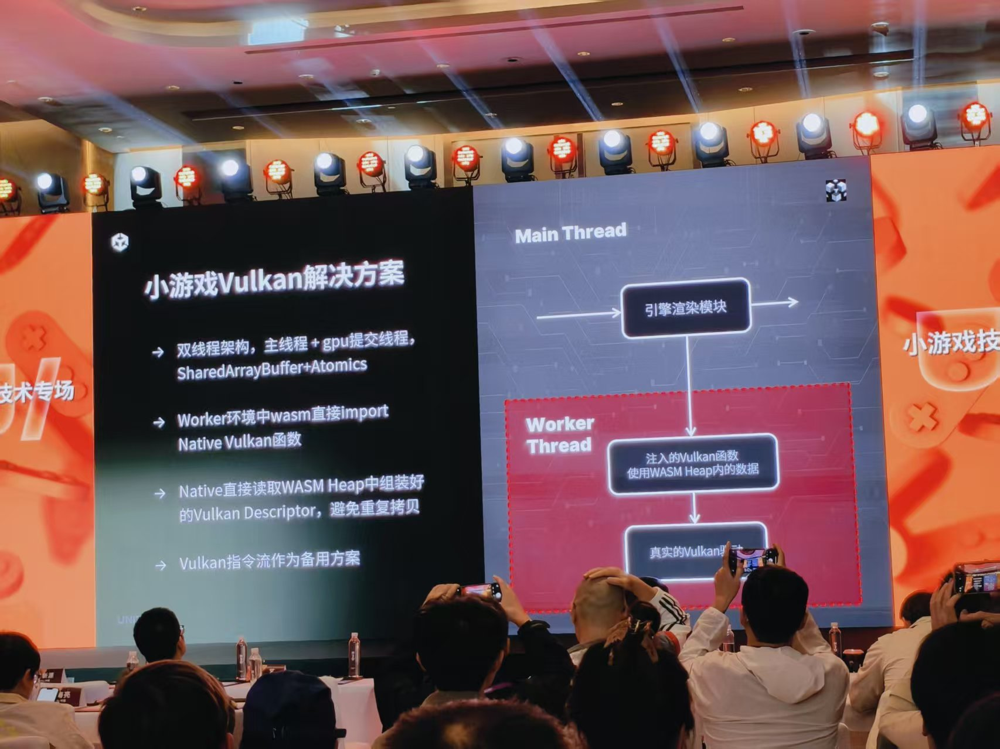

# 移动平台的图形引擎

## 概述
WebGL和 WebGPU 是用于网页浏览器的图形 API，Metal 和 Vulkan 是用于操作系统和硬件的“原生” (Native) 图形 API。

WebGL 和WebGPU是网页渲染的写法，但是真实渲染到电脑上，需要用电脑的渲染API，所以要翻译。而翻译这件事是浏览器在做的。

## WebGL

- **定义**：JavaScript API，用于在浏览器中渲染 2D 和 3D 图形，无需任何插件。

- **版本历史**：
  - WebGL 1.0 基于 OpenGL ES 2.0
  - WebGL 2.0（目前主流）基于 OpenGL ES 3.0（2012年发布）

- **现状**：已经过时，WebGL不会再有任何Major Feature Update。

- **主要限制**：缺失现代图形API的常用特性：Compute Shader，SSBO，Indirect Draw

## WebGPU

W3C 正在制定的下一代网页图形 API，被视为 WebGL 的继任者。

- 浏览器环境，着重跨平台

- 无原生驱动，和WebGL一样需要转译

- 仍在完善中

## Metal

- 苹果的专属图形API接口，从iOS13起成为"唯一"官方支持的图形接口

- 可使用Apple芯片专属图形特征

### 小游戏Metal解决方案

游戏逻辑在 WASM 中高速运行，把渲染指令"打包"成数据，通过 XHR 发送给原生 App，原生 App 再"解包"并调用真正的 Metal API 去画图。 这完全绕过了 WebKit 的 WebGL 渲染管线。

#### 1. 顶层：WebKit 进程 (WASM)

- 游戏逻辑（很可能是C++或Rust写的）被编译成了 WASM (WebAssembly)，以高性能运行在 WebKit 进程中。

- 游戏"以为"自己在调用 Metal API。但实际上，它调用的是一个"假的" Metal 接口。

- **编码层：** 这个"假接口"不执行任何渲染，而是把所有的 Metal 调用（比如"设置这个纹理"、"画 500 个三角形"）编码 (Encode) 成一个自定义的"指令流"（一长串二进制数据）。

#### 2. 中间层：跨进程通信 (XHR)

- 在 WASM 里生成的"指令流"需要被发送出去。

- 使用了 XMLHttpRequest (XHR)——这个通常用于网页请求网络数据的工具——来作为跨进程通信 (IPC) 的桥梁。

- **流程：** WASM 把编码好的指令流数据，通过 XHR "发送"给"宿主进程"。

#### 3. 底层：宿主进程 (Native Metal)

- "宿主"指的是包着这个 WebKit 的原生 App（比如微信、抖音等）。

- 宿主进程接收到这个 XHR 请求（实际上是来自内部的数据）。

- **解码与提交：** 宿主进程的原生代码（Objective-C / Swift）解码这个"指令流"，并将其"翻译"回真正的 Metal API 指令，然后提交给 GPU 去执行。

### Shared Buffer
在 iPhone 和 iPad 上，CPU 和 GPU 共享同一块物理内存 (RAM)。

上传数据： CPU 往这块内存里写入数据（比如更新粒子位置），然后通知 GPU：“你可以去读了”。GPU 不需要“拷贝”，直接就能读到 CPU 刚写的数据。

GPU 回读： Compute Shader 把计算结果写回这块内存，然后通知 CPU：“我写完了”。CPU 不需要“下载”，直接就能读到 GPU 刚算出的结果。

需要写入数据的游戏逻辑 (WASM) 运行在 WebKit 进程 (进程1) 中

### 为什么“XHR 指令流方案”做不到
这个方案横跨了两个独立的进程，这两个进程都运行在手机端，但是存在数据隔离：

- WebKit 进程： 运行游戏逻辑 (WASM)。

- 宿主进程： 运行原生 App 代码，调用真正的 Metal。

那块“真正的 Metal Shared Buffer” 是由宿主进程 (进程2) 创建和拥有的。而需要写入数据的游戏逻辑 (WASM) 运行在 WebKit 进程 (进程1) 中。
由于“内存隔离”，WASM 不可能拿到那块 Shared Buffer 的内存地址。因此，数据必须被“拷贝”：

- 上传 (WASM -> Metal)： WASM 必须把它的数据（比如顶点数组）打包并拷贝到 XHR 请求体中。

- 宿主进程收到 XHR 请求，再从请求体中拷贝出数据。

- 宿主进程再把这些数据拷贝到真正的 Metal Buffer 中。

这里发生了至少两次数据拷贝，而不是零拷贝）。

- 回读 (Metal -> WASM)： 流程反过来，同样需要多次拷贝。

## Vulkan

- OpenGL(ES)的后继者

- 对GPU最底层、最精确的控制

- 逐渐成为重度渲染的移动端游戏的首选

- 驱动仍在完善，需要手动调优

### 双线程思路
使用两个线程，而非两个进程，这样两个线程之间的数据是共享的。
- Main Thread (主线程)：负责处理所有与用户交互的事情，比如点击屏幕、UI 动画、游戏的主要逻辑更新等
- Worker Thread (工作线程)：唯一工作就是处理所有繁重的渲染任务，准备 Vulkan 指令、调用 Native 函数、与 GPU 通信。

### 关键技术：SharedArrayBuffer + Atomics
SharedArrayBuffer (SAB)：这是现代 Web API 的一个特性。允许 Main Thread 和 Worker Thread 创建一块它们都能读写的“共享内存区域”。

Atomics：这是一组用于“同步”的指令。当 Worker 正在写入这块内存时，Atomics 可以确保主线程不会同时去读取它，反之亦然，保证了数据安全。

### WASM 直接调用 Native
如图所示，所有的渲染运行在 Worker Thread 中。

宿主 App（比如微信）会把“真实的 Vulkan 函数”（用 C++ 编写的）“注入” 到这个 Worker 线程中。这意味着 WASM 可以直接 import 并调用这些“原生 (Native) Vulkan 函数”。

### 结果：零拷贝 (Zero-Copy)

1.  Main Thread 准备好渲染数据（比如场景信息）。

1.  Main Thread 把数据写入到 SharedArrayBuffer 中。

1. Worker Thread 里的 WASM 直接从这块 SharedArrayBuffer（也就是它的 WASM Heap）中读取数据，并组装成 Vulkan 需要的 Descriptor (渲染指令)。

1. WASM 调用那个被“注入”的 Native Vulkan 函数。

1. Native 函数也直接从那块 SharedArrayBuffer 中读取 WASM 组装好的指令，然后提交给 GPU。

数据从始至终都在同一块共享内存里，没有发生任何“拷贝”。